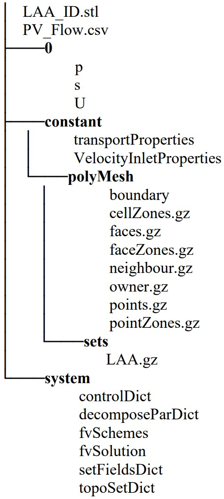
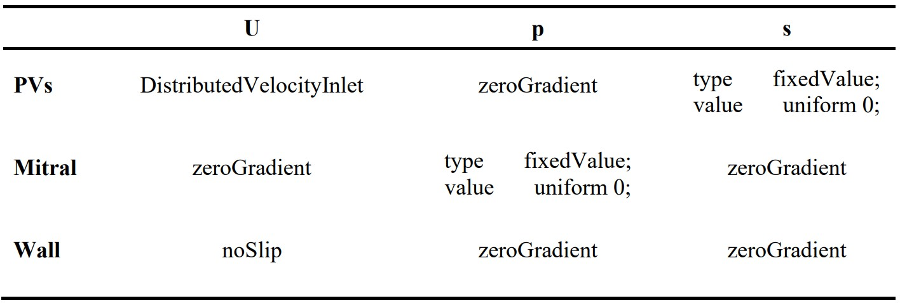

Please cite our paper if you find this repository usefull:</br>
Sanatkhani, S., Nedios, S., Menon, P. G., Saba, S. F., Jain, S. K., Federspiel, W. J., & Shroff, S. G. (2023). Subject-specific factors affecting particle residence time distribution of left atrial appendage in atrial fibrillation: A computational model-based study. <i>Front Cardiovasc Med</i>, 10(1070498), 1-13. <a href = "https://doi.org/10.3389/fcvm.2023.1070498" target="_blank">doi: 10.3389/fcvm.2023.1070498</a></li>

# icoFoamDistVel
This solver is consisted of a main function defined in ScalarAdvection.C and a boundary condition for PV inlets, DistributedVelocityInlet. Continuity equation, momentum equations and transport equations are solved in ScalarAdvection.C. A Piso loop is being used to solve momentum equations. Transport equation is being solved at each time step after pressure and velocity calculation in Piso loop. Further, PV flow is read from a CSV file at each time step and velocity at PV inlets is calculated based on the total surface area of PV inlets.

Directory structure for setup of a sample subject simulation using ScalarAdvection is presented below:



where LAA surface geometry is presented in LAA_ID.stl. PV flow throughout a cardiac length is stored in PV_Flow.csv in two columns separated by a comma, where time is in the first column and PV flow (L min-1) in second column. Folder 0 is consisted of boundary conditions and initial values for pressure, velocity, and tracer concentration. CFD Mesh information is stored in polyMesh folder within the constant folder. Viscosity and density of blood are set in transportProperties file. Discretization schemes and model tolerances are defined in fvSchemes and fvSolution respectively. Number of domains that the CFD mesh is decomposed into for parallel processing is set in decomposeParDict. setFieldsDict is used to set the initial tracer concentration inside the LAA to 1. topoSetDict is used to define LAA as a zone so that it can later be used in a function in controlDict to calculate volumetric average of tracer concentration inside the LAA at each time step.


### Boundary conditions used with ScalarAdvection solver



```
//////////////////////////////////////////////////////////////////////
// * * * * * * * * * * * * * * * setFieldsDict * * * * * * * * * * *//
//////////////////////////////////////////////////////////////////////
defaultFieldValues
(
    volScalarFieldValue s 0
);

regions
(
    surfaceToCell
    {
		file			"LAA_135.stl";
		outsidePoints	((0 0 0));
		includeCut		true;
		includeInside	yes;
		includeOutside	no;
		nearDistance	-0.01;
		curvature		0.5;
        fieldValues
        (
            volScalarFieldValue s 1
        );
    }
);
// * * * * * * * * * * * * * * * * * * * * * * * * * * * * * * * * *//
//////////////////////////////////////////////////////////////////////
```
```
//////////////////////////////////////////////////////////////////////
// * * * * * * * * * * * * * topoSetDict * * * * * * * * * * * * * *// //////////////////////////////////////////////////////////////////////
actions
(
    // LAA
    {
        name    LAA;
        type    cellZoneSet;
        action  new;
        source  surfaceToCell;
        sourceInfo
        {
			file			"LAA_135.stl";
			outsidePoints	((0 0 0));
			includeCut		true;
			includeInside	yes;
			includeOutside	no;
			nearDistance	-0.01;
			curvature		0.5;
        }
    }
);
// * * * * * * * * * * * * * * * * * * * * * * * * * * * * * * * * *//
//////////////////////////////////////////////////////////////////////
```
```
//////////////////////////////////////////////////////////////////////
// * * * * * * * * * * * * * controlDict Function * * * * * * * * * //
//////////////////////////////////////////////////////////////////////
functions
{

	LAA_S
	{
		type            volFieldValue;
		libs            ("libfieldFunctionObjects.so");
		log             true;
		writeControl    timeStep;
		writeInterval   1600;
		writeFields     false;
		writeFormat		ascii;
		writePrecision  2;
		writeToFile     true;
		regionType      cellZone;
		name            LAA;
		operation       volIntegrate;
		fields
		(
			s
		);
	}	
}
// * * * * * * * * * * * * * * * * * * * * * * * * * * * * * * * * *//
//////////////////////////////////////////////////////////////////////
```
